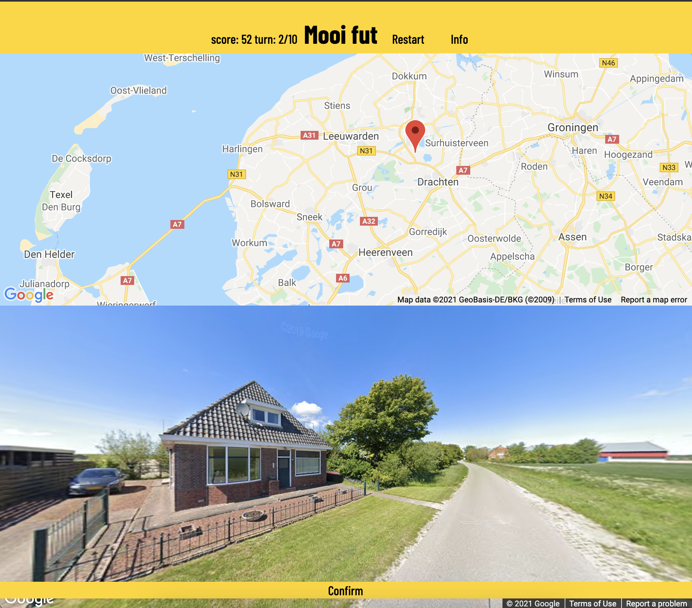

# mp2_geo

[Visit](https://jildourixt.github.io/mp2_geo/.)

## User Experience (UX)

### User stories
* First time visitor goals
	* As a first time visitor, I want to instantly understand the main purpose of the site.
	* As a first time visitor I want to be able to play the game without a steap or long learning curve.
* Returning visitor goals
	* As a returning visitor, I want the game to still be challenging and exciting.
* Frequent user goals
	* As a frequent user, I want the game to keep giving me content 

### Design
* Colour Scheme
* Typography
* Imagery
	* All images used on this page are part of the Google Street View Static API.

### Wireframes
| Homepage desktop | Homepage mobile |
| ---------------- | --------------- |
|  |  |
|  |  |

## Features

## Technologies used
### Languages used
* [HTML5](https://en.wikipedia.org/wiki/HTML5)
* [CSS3](https://en.wikipedia.org/wiki/Cascading_Style_Sheets)
* [JavaScript](https://en.wikipedia.org/wiki/JavaScript)

### Frameworks used
* [Git](https://git-scm.com/)
	* Git was used for version control throughout the whole project by using Github Desktop as well as command lines. 
* [Github](https://github.com/)
	* Github is used to store the projects code after being pushed from Git.
* [Google Fonts](https://fonts.google.com/)
	* Goole Fonts were used to import the Barlow Condensed font into the style.css file.
* [Wireframes|cc](https://wireframe.cc)
	* Wireframes|cc was used for creating the wireframes for this website.
* [Font Awesome](https://fontawesome.com/)
	* Font Awesome was used for the icon elements in the navigation bar in the footer as well as the social media and contact buttons in the header.
* [Google Maps API](https://developers.google.com/maps/documentation/javascript/overview)
	* Google Maps API is a big part of this game. It is both used for the map as well as the streetview panorama.

## Testing

The testing of CSS and HTML was done through W3C markup Validator and the W3C CSS Validator Services. The page was tested and validated without errors. 

* [W3C Markup Validator](https://jigsaw.w3.org/css-validator/#validate_by_input)
* [W3C Nu HTML Checker](https://validator.w3.org/nu/#textarea)

JavaScript was tested through [JSHint](https://jshint.com) and returned no errors.

### Further testing

Further testing was done manually.
* For first time user user stories, I have asked friends to try this website without any further instructions. There were no bugs found and UI was found to be non-ambiguous and easy to follow.
* Testing for responsiveness and other has been done on both desktop as well as mobile sizes on both Chrome and Safari.

### Known bugs
The one bug that is known is that it is still possible, yet unlikely, to get the same location twice within a game. 

## Deployment

### GitHub Pages

The project was deployed to GitHub Pages using the following steps...
1. Log in to GitHub and locate the [GitHub Repository](https://github.com/jildourixt/mp2_geo.git)
2. At the top of the Repository (not top of page), locate the "Settings" Button on the menu.
4. Scroll down the Settings page until you locate the "GitHub Pages" Section.
5. Under "Source", click the dropdown called "None" and select "Master Branch".
6. The page will automatically refresh.
Scroll back down through the page to locate the now published site link in the "GitHub Pages" section.

### Forking the GitHub Repository

By forking the GitHub Repository we make a copy of the original repository on our GitHub account to view and/or make changes without affecting the original repository by using the following steps...

1. Log in to GitHub and locate the [GitHub Repository](https://github.com/jildourixt/mp2_geo.git)
2. At the top of the Repository (not top of page) just above the "Settings" Button on the menu, locate the "Fork" Button.
3. You should now have a copy of the original repository in your GitHub account.

### Making a Local Clone

1. Log in to GitHub and locate the [GitHub Repository](https://github.com/jildourixt/mp2_geo.git)
2. Under the repository name, click "Clone or download".
3. To clone the repository using HTTPS, under "Clone with HTTPS", copy the link.
4. Open Git Bash
5. Change the current working directory to the location where you want the cloned directory to be made.
6. Type git clone, and then paste the URL you copied in Step 3.
``` 
$ git clone https://github.com/jildourixt/second-website.git
```
7. Press Enter. Your local clone will be created.

## Credits

### Acknowledgements
* My mentor for continuous helpful feedback.
* Tutor support at Code Institute for their support and materials.